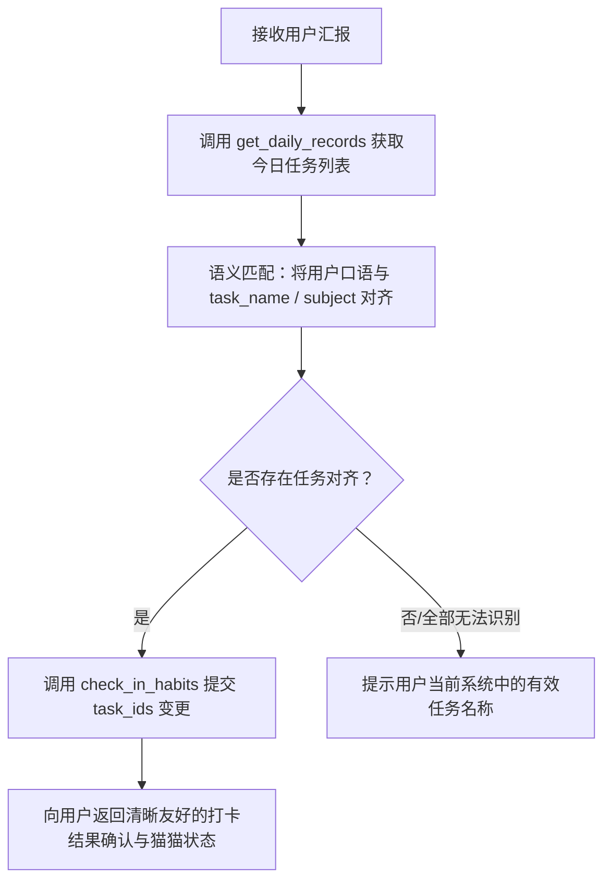

# Habits Tracker MCP — Agent 指南与操作规范

本文档供 AI Agent（如 Claude、Cursor、Antigravity 等）阅读，用于理解如何接入和使用 Habits Tracker（小鱼干·学习习惯追踪）MCP 服务，代行用户的每日打卡与习惯追踪。

---

## 1. 服务配置与连接

### 1.1 启动方式
MCP 服务采用 PEP 723 格式，由 `uv` 独立驱动：
- **执行命令**：`uv`
- **参数列表**：`["run", "--directory", "<项目根目录绝对路径>", "mcp_server/server.py"]`

### 1.2 环境变量
- `HABITS_API_BASE`：后端 HTTP 地址，默认 `http://127.0.0.1:15000`。
- `HABITS_SESSION_TOKEN`：（推荐）从已登录浏览器 Cookie 中提取的 `session_token`（有效期 30 天）。若设置，优先使用该凭据。
- `HABITS_USERNAME`：登录用户名（默认 `meow`，小朋友角色）。
- `HABITS_PASSWORD`：登录密码（默认 `child`）。

### 1.3 客户端配置格式（JSON）
```json
{
  "mcpServers": {
    "habits-tracker": {
      "command": "uv",
      "args": [
        "run",
        "--directory",
        "<项目绝对路径>",
        "mcp_server/server.py"
      ],
      "env": {
        "HABITS_API_BASE": "http://127.0.0.1:15000",
        "HABITS_SESSION_TOKEN": "<可选 session_token>"
      }
    }
  }
}
```

---

## 2. 工具参考（Tools）

| 工具名称 | 核心参数 | 返回关键字段 | 典型调用时机 |
| :--- | :--- | :--- | :--- |
| `get_daily_records` | `target_date: str` (可选，默认今日) | `records`（含 `task_id`, `subject`, `task_name`, `completed`, `reward`）、`completed_count`、`total_count`、`emoji`、`total_reward` | 用户汇报打卡、询问当天进度时，**必须首先调用** |
| `check_in_habits` | `target_date: str`, `completed_task_ids: list[str]`, `uncompleted_task_ids: list[str]` | 更新后的 `completed_count`、`emoji`、`total_reward`、`records` | 完成语义对齐后，执行勾选或取消勾选 |
| `get_weekly_summary` | `target_date: str` (可选，默认今日) | `week`、`expected_earn`、`week_completed_days`、`task_progress`（含各任务周完成数与达标状态 `qualified`） | 用户询问本周达标情况、收益统计时调用 |

---

## 3. 标准操作工作流（Agent Execution Protocol）

当用户发出自然语言汇报（例如：“今天背了英语单词，做完口算了，语文阅读还没来得及读”）时，必须遵循以下步骤：



### Step 1: 必须先读后写（Read Before Write）
**禁止在未获取当天任务列表的情况下猜测 `task_id`。**  
收到汇报后，首先调用 `get_daily_records(target_date="")`，获取当前数据库中实际存在的活跃任务列表及其当前 `completed` 状态。

### Step 2: 语义映射与意图消歧
- 用户口语常与任务名略有差异，利用科目（`subject`）与名称（`task_name`）进行模糊对齐：
  - *“口算” / “每天口算”* $\rightarrow$ `math_calc`（数学 - 计算）
  - *“背单词” / “百词斩”* $\rightarrow$ `en_word`（英语 - 单词）
  - *“晨读”* $\rightarrow$ `cn_morning`（语文 - 晨读）
- 若某项任务未被提及：保持现状，不要将其放入 `uncompleted_task_ids`，除非用户明确说“今天XX没做”。
- 若用户提到列表中不存在的任务：在最终回复中委婉告知该项未在系统中配置。

### Step 3: 执行变更
调用 `check_in_habits`，传入匹配出的 `completed_task_ids` 和 `uncompleted_task_ids`。

### Step 4: 结果反馈
使用温暖、鼓励的语气向用户汇报（尤其是小朋友场景）：
1. 明确列出**已勾选的任务**与**未完成的任务**。
2. 附带猫猫状态表情反馈（如 😺🎉、😸、😼、😿）以及今日累计预估收益。

---

## 4. 业务边界与错误处理防线

1. **不可打卡未来日期**：
   - 后端有强校验拦截，严禁提交大于今天的日期打卡。
2. **小朋友角色窗口期**：
   - 默认账号（`meow`）为小朋友角色，仅能修改**最近 7 天**的记录。超出窗口期时后端会返回 403，Agent 应如实转达“已超出 7 天可修改窗口，如需补录请联系家长账号”。
3. **幂等性保障**：
   - 重复勾选已完成的任务是安全的，系统会自动保持最新状态并刷新 `updated_at` 时间戳。
